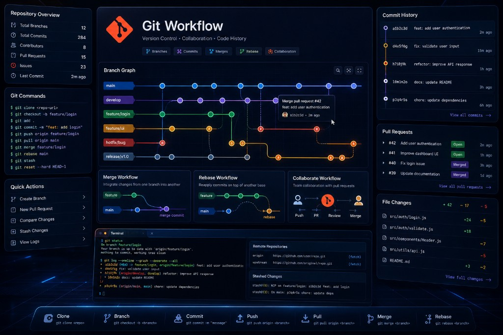

# Hướng dẫn sử dụng Git

Tài liệu này sắp xếp các lệnh Git theo luồng sử dụng thực tế: cài đặt, cấu hình, làm việc hằng ngày, quản lý remote, SSH, stash, rebase và xử lý sự cố.



## Mục lục

- [1. Cài đặt và kiểm tra Git](#1-cài-đặt-và-kiểm-tra-git)
- [2. Cấu hình Git ban đầu](#2-cấu-hình-git-ban-đầu)
- [3. Quy trình Git cơ bản hằng ngày](#3-quy-trình-git-cơ-bản-hằng-ngày)
- [4. Clone repository theo nhu cầu](#4-clone-repository-theo-nhu-cầu)
- [5. Quản lý branch](#5-quản-lý-branch)
- [6. Quản lý Remote Repository](#6-quản-lý-remote-repository)
- [7. Cấu hình SSH cho GitHub/GitLab](#7-cấu-hình-ssh-cho-githubgitlab)
- [8. Stash thay đổi tạm thời](#8-stash-thay-đổi-tạm-thời)
- [9. Rebase, squash và chỉnh lịch sử commit](#9-rebase-squash-và-chỉnh-lịch-sử-commit)
- [10. Lệnh xử lý sự cố Git thường gặp](#10-lệnh-xử-lý-sự-cố-git-thường-gặp)

## 1. Cài đặt và kiểm tra Git

- **Tải Git**: [Git Installation Guide](https://git-scm.com/book/en/v2/Getting-Started-Installing-Git)
- **Kiểm tra phiên bản Git**:

```bash
git --version
```

## 2. Cấu hình Git ban đầu

### Cấu hình username và email

```bash
git config --global user.name "<username>"
git config --global user.email "<email>"
```

### Kiểm tra cấu hình hiện tại

```bash
git config --global --list
```

### Kiểm tra riêng username hoặc email

```bash
git config --global user.name
git config --global user.email
```

### Bật lưu credential nếu thường xuyên bị hỏi username/password

```bash
git config --global credential.helper store
```

> **Lưu ý**: Cách này lưu credential trên máy local. Chỉ dùng trên máy cá nhân hoặc môi trường đáng tin cậy.

## 3. Quy trình Git cơ bản hằng ngày

### Khởi tạo repository mới

```bash
git init
```

### Kiểm tra trạng thái file

```bash
git status
```

### Thêm thay đổi vào stage

```bash
git add .
```

Hoặc thêm từng file cụ thể:

```bash
git add path/to/file
```

### Commit thay đổi

```bash
git commit -m "Mô tả ngắn gọn thay đổi"
```

### Lấy code mới nhất từ remote

```bash
git pull origin <branch_name>
```

### Đẩy code lên remote

```bash
git push origin <branch_name>
```

### Xem lịch sử commit

```bash
git log --oneline
```

### Xem nội dung thay đổi chưa commit

```bash
git diff
```

### Xem nội dung đã stage

```bash
git diff --staged
```

## 4. Clone repository theo nhu cầu

### Clone repository về máy

```bash
git clone <repository-url>
```

### Clone một branch cụ thể

```bash
git clone -b <branch_name> <repository-url>
```

Hoặc dùng `--branch`:

```bash
git clone --branch <branch_name> <repository-url>
```

### Clone một branch và chỉ lấy commit mới nhất

```bash
git clone --depth 1 --branch <branch_name> <repository-url>
```

> **Lưu ý**:
>
> - Vẫn lấy đầy đủ source code tại thời điểm commit mới nhất của branch đó.
> - Vẫn có thể dùng `git pull` để lấy code mới về.
> - Sẽ không có lịch sử commit cũ trước thời điểm clone.
> - Nếu cần lấy lại toàn bộ lịch sử, chạy `git fetch --unshallow`.

## 5. Quản lý branch

### Xem branch hiện tại

```bash
git branch
```

### Xem cả branch local và remote

```bash
git branch -a
```

### Tạo branch mới

```bash
git branch <branch_name>
```

### Chuyển sang branch khác

```bash
git checkout <branch_name>
```

Hoặc dùng lệnh mới hơn:

```bash
git switch <branch_name>
```

### Tạo và chuyển sang branch mới

```bash
git checkout -b <branch_name>
```

Hoặc:

```bash
git switch -c <branch_name>
```

### Xóa branch local

```bash
git branch -d <branch_name>
```

Nếu branch chưa được merge và vẫn muốn xóa:

```bash
git branch -D <branch_name>
```

### Xóa branch remote

```bash
git push origin --delete <branch_name>
```

## 6. Quản lý Remote Repository

### Kiểm tra remote hiện tại

```bash
git remote -v
```

### Thêm remote origin

```bash
git remote add origin <repository-url>
```

### Thay đổi URL của remote origin

```bash
git remote set-url origin <repository-url>
```

Ví dụ:

```bash
git remote set-url origin https://github.com/unclecatvn/BaseJava.git
```

### Xóa remote origin và thêm lại

```bash
git remote remove origin
git remote add origin <repository-url>
```

### Thiết lập upstream khi push lần đầu

```bash
git push -u origin <branch_name>
```

Sau khi đã có upstream, những lần sau chỉ cần:

```bash
git push
git pull
```

## 7. Cấu hình SSH cho GitHub/GitLab

### Tạo SSH key mới

```bash
ssh-keygen -t ed25519 -C "your_email@example.com"
```

Nhấn `Enter` để sử dụng đường dẫn mặc định:

```bash
~/.ssh/id_ed25519
```

### Thêm SSH key vào SSH agent

```bash
eval "$(ssh-agent -s)"
ssh-add ~/.ssh/id_ed25519
```

### Sao chép public key

```bash
cat ~/.ssh/id_ed25519.pub
```

Copy toàn bộ nội dung hiển thị, bắt đầu từ `ssh-ed25519` hoặc `ssh-rsa` đến cuối dòng.

### Thêm SSH key vào GitHub

1. Vào **Settings** > **SSH and GPG keys**.
2. Chọn **New SSH key**.
3. Dán public key đã copy.
4. Chọn **Add SSH key**.

### Kiểm tra kết nối SSH với GitHub

```bash
ssh -T git@github.com
```

Kết quả mong đợi:

```text
Hi username! You've successfully authenticated...
```

### Clone repository qua SSH

```bash
git clone git@github.com:username/repository.git
```

### Đổi remote từ HTTPS sang SSH

```bash
git remote set-url origin git@github.com:username/repository.git
git remote -v
```

## 8. Stash thay đổi tạm thời

### Lưu thay đổi hiện tại vào stash

```bash
git stash
```

### Lưu stash kèm mô tả

```bash
git stash push -m "Mô tả thay đổi đang làm"
```

### Xem danh sách stash

```bash
git stash list
```

### Xem nội dung một stash

```bash
git stash show stash@{0}
git stash show -p stash@{0}
```

### Apply stash nhưng vẫn giữ lại trong danh sách

```bash
git stash apply stash@{0}
```

### Apply stash và xóa khỏi danh sách

```bash
git stash pop stash@{0}
```

### Xóa stash mới nhất

```bash
git stash drop
```

### Xóa stash cụ thể

```bash
git stash drop stash@{0}
```

### Xóa tất cả stash

```bash
git stash clear
```

## 9. Rebase, squash và chỉnh lịch sử commit

### Rebase branch hiện tại với branch khác

```bash
git fetch origin
git rebase origin/<branch_name>
```

Ví dụ:

```bash
git fetch origin
git rebase origin/18.0
```

### Push sau khi rebase

Nếu remote chưa bị thay đổi lịch sử:

```bash
git push origin <branch_name>
```

Nếu rebase làm thay đổi lịch sử commit:

```bash
git push origin <branch_name> --force-with-lease
```

> **Lưu ý**: `--force-with-lease` an toàn hơn `--force` vì Git sẽ kiểm tra remote trước khi ghi đè lịch sử.

### Gộp thay đổi vào commit gần nhất

```bash
git add .
git commit --amend --no-edit
git push origin <branch_name> --force-with-lease
```

### Sửa message của commit gần nhất

```bash
git commit --amend -m "Message commit mới"
git push origin <branch_name> --force-with-lease
```

### Interactive rebase để sửa, xóa, squash hoặc reorder commit

```bash
git rebase -i HEAD~2
```

Sau khi chạy lệnh trên, editor sẽ mở ra với nội dung tương tự:

```text
pick 1a2b3c4 [IMP] dtg_sale_report: Add COD report. (#1249)
pick 5d6e7f8 [IMP] Improved invoice and transaction update process

# Commands:
# p, pick <commit> = use commit
# r, reword <commit> = use commit, but edit the commit message
# e, edit <commit> = use commit, but stop for amending
# s, squash <commit> = use commit, but meld into previous commit
# f, fixup <commit> = like "squash", but discard this commit's log message
# d, drop <commit> = remove commit
```

Các thao tác thường dùng:

- Giữ commit: để nguyên `pick`.
- Sửa message: đổi `pick` thành `reword`.
- Gộp commit vào commit phía trên: đổi `pick` thành `squash` hoặc `fixup`.
- Xóa commit: đổi `pick` thành `drop`.
- Đổi thứ tự commit: di chuyển dòng commit lên/xuống.

Ví dụ xóa một commit:

```text
drop 1a2b3c4 [IMP] dtg_sale_report: Add COD report. (#1249)
pick 5d6e7f8 [IMP] Improved invoice and transaction update process
```

Lưu và thoát editor:

- **Vim**: nhấn `Esc`, gõ `:wq`, nhấn `Enter`.
- **Nano**: nhấn `Ctrl + X`, nhấn `Y`, nhấn `Enter`.

Nếu có conflict trong lúc rebase, sửa file bị conflict rồi chạy:

```bash
git add .
git rebase --continue
```

Nếu muốn hủy rebase:

```bash
git rebase --abort
```

## 10. Lệnh xử lý sự cố Git thường gặp

### Kiểm tra nhanh repo đang gặp vấn đề gì

```bash
git status
git branch
git remote -v
git log --oneline -5
```

### Lỡ `git add .` nhầm

Gỡ tất cả file khỏi stage nhưng giữ nguyên thay đổi:

```bash
git restore --staged .
```

Gỡ một file khỏi stage:

```bash
git restore --staged path/to/file
```

### Muốn bỏ thay đổi chưa commit của một file

```bash
git restore path/to/file
```

### Muốn bỏ toàn bộ thay đổi chưa commit

```bash
git restore .
```

> **Cẩn thận**: Lệnh này xóa thay đổi local chưa commit. Nếu chưa chắc, hãy stash trước bằng `git stash push -m "backup before restore"`.

### Muốn quay lại trạng thái của branch remote

```bash
git fetch origin
git reset --hard origin/<branch_name>
```

> **Cẩn thận**: `reset --hard` xóa thay đổi local chưa commit. Chỉ dùng khi chắc chắn không cần giữ thay đổi hiện tại.

### Commit nhầm message

```bash
git commit --amend -m "Message đúng"
```

Nếu commit đã push lên remote:

```bash
git push origin <branch_name> --force-with-lease
```

### Commit thiếu file

```bash
git add path/to/missing-file
git commit --amend --no-edit
```

Nếu commit đã push lên remote:

```bash
git push origin <branch_name> --force-with-lease
```

### Lỡ commit vào sai branch

Lưu mã commit vừa tạo:

```bash
git log --oneline -1
```

Chuyển sang branch đúng và lấy commit đó qua:

```bash
git switch <correct_branch>
git cherry-pick <commit_hash>
```

Quay lại branch sai và xóa commit vừa commit nhầm:

```bash
git switch <wrong_branch>
git reset --hard HEAD~1
```

### Muốn hủy commit gần nhất nhưng giữ lại code

Giữ thay đổi trong stage:

```bash
git reset --soft HEAD~1
```

Giữ thay đổi trong working tree, không stage:

```bash
git reset HEAD~1
```

### Muốn hủy commit gần nhất và bỏ luôn code

```bash
git reset --hard HEAD~1
```

> **Cẩn thận**: Lệnh này xóa cả commit và code trong commit đó khỏi local branch.

### Pull bị conflict

1. Kiểm tra file conflict:

```bash
git status
```

2. Mở file conflict và xử lý các đoạn:

```text
<<<<<<< HEAD
Code hiện tại của bạn
=======
Code từ branch được merge/pull
>>>>>>> branch-name
```

3. Sau khi sửa xong:

```bash
git add .
git commit
```

Nếu conflict xảy ra trong rebase:

```bash
git add .
git rebase --continue
```

### Muốn hủy merge đang conflict

```bash
git merge --abort
```

### Muốn hủy rebase đang conflict

```bash
git rebase --abort
```

### Push bị rejected vì remote có commit mới

Cách an toàn nhất là pull rebase trước rồi push lại:

```bash
git fetch origin
git rebase origin/<branch_name>
git push origin <branch_name>
```

Nếu có conflict:

```bash
git status
git add .
git rebase --continue
git push origin <branch_name>
```

### Không biết vừa làm sai gì và muốn tìm lại commit cũ

Dùng `reflog` để xem lịch sử di chuyển của `HEAD`:

```bash
git reflog
```

Quay lại một mốc cụ thể:

```bash
git reset --hard <commit_hash>
```

Hoặc tạo branch mới từ mốc đó để kiểm tra trước:

```bash
git switch -c recover-branch <commit_hash>
```

### Remote URL sai

```bash
git remote -v
git remote set-url origin <repository-url>
git remote -v
```

### Lỗi không có upstream branch

Khi push branch mới lần đầu:

```bash
git push -u origin <branch_name>
```

### Lỗi authentication khi push/pull

Kiểm tra remote đang dùng HTTPS hay SSH:

```bash
git remote -v
```

Nếu muốn dùng SSH:

```bash
ssh -T git@github.com
git remote set-url origin git@github.com:username/repository.git
```

Nếu dùng HTTPS, hãy kiểm tra lại Personal Access Token hoặc credential đã lưu.

### Kiểm tra file nào đang được Git theo dõi

```bash
git ls-files
```

### Xóa file khỏi Git nhưng vẫn giữ file trên máy

```bash
git rm --cached path/to/file
```

Thường dùng khi lỡ commit file cấu hình local như `.env`.
