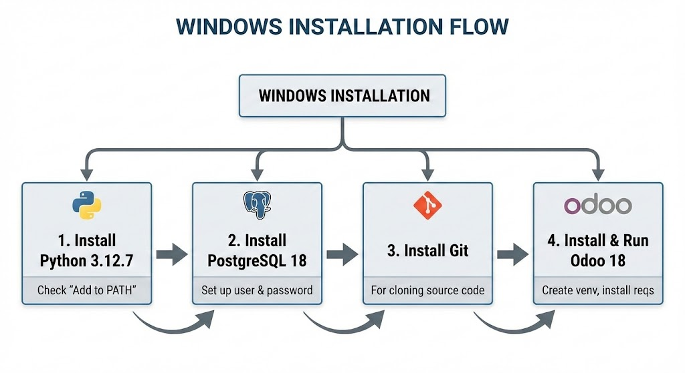
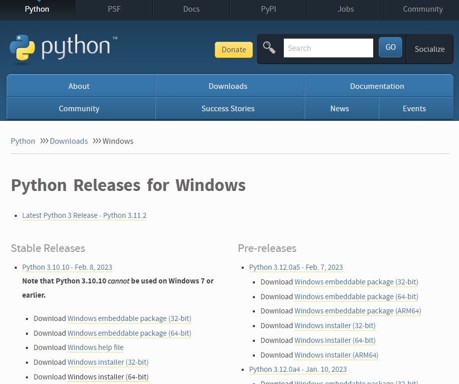
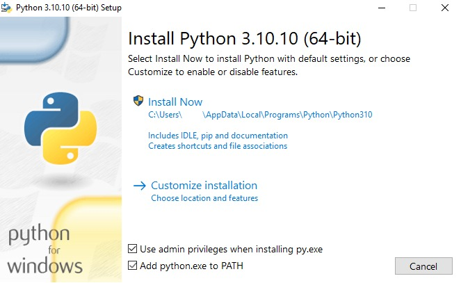

# 📦 Hướng Dẫn Cài Đặt Odoo 18

<div align="center">


**Hướng dẫn cài đặt Odoo 18 đầy đủ cho Windows, Ubuntu/Debian và macOS**

</div>

---

## 📋 Mục Lục

- [Giới Thiệu](#-giới-thiệu)
- [Yêu Cầu Hệ Thống](#-yêu-cầu-hệ-thống)
- [Cài Đặt Trên Windows](#-cài-đặt-trên-windows)
- [Cài Đặt Trên Ubuntu/Debian](#-cài-đặt-trên-ubuntudebian)
- [Cài Đặt Trên macOS](#-cài-đặt-trên-macos)
- [Kiểm Tra và Khởi Động](#-kiểm-tra-và-khởi-động)
- [Vấn Đề Thường Gặp](#-vấn-đề-thường-gặp--giải-pháp)
- [Tối Ưu Performance](#-tối-ưu-performance)
- [Backup & Restore](#-backup--restore)
- [Tham Khảo](#-tham-khảo--liên-kết-hữu-ích)

---

## 🌟 Giới Thiệu

Odoo 18 là phiên bản mới nhất của hệ thống ERP/CRM mã nguồn mở hàng đầu thế giới. Phiên bản này mang đến nhiều cải tiến về:

- ⚡ **Hiệu suất** - Tốc độ xử lý nhanh hơn 30%
- 🎨 **Giao diện** - UI/UX hiện đại và thân thiện
- 🔧 **Tính năng** - Nhiều module mới và cải tiến
- 🔒 **Bảo mật** - Nâng cấp các tiêu chuẩn an ninh

---

## 💻 Yêu Cầu Hệ Thống

| Thành phần     | Yêu cầu tối thiểu       |
| -------------- | ----------------------- |
| **CPU**        | 2 cores                 |
| **RAM**        | 4 GB (khuyến nghị 8 GB) |
| **Disk**       | 20 GB                   |
| **Python**     | 3.12.7                  |
| **PostgreSQL** | 18                      |
| **Node.js**    | 16 hoặc cao hơn         |

---

## 🪟 Cài Đặt Trên Windows



### 📥 Bước 1: Cài Đặt Python

1. Truy cập: https://www.python.org/downloads/
2. Tải phiên bản **Python 3.12.7** (64-bit)

**Hình 1-2: Trang tải Python**




3. Chạy installer, **đánh dấu "Add Python to PATH"** ⚠️

**Hình 3: Màn hình cài đặt Python**



> [!IMPORTANT]
> Bắt buộc phải chọn "Add Python to PATH" khi cài đặt!

**Kiểm tra cài đặt:**

```cmd
python --version
pip --version
```

### 📥 Bước 2: Cài Đặt PostgreSQL

1. Truy cập: https://www.postgresql.org/download/windows/
2. Tải **PostgreSQL 18**
3. Chạy installer và ghi nhớ mật khẩu superuser

**Cấu hình PostgreSQL:**

1. Mở **pgAdmin 4** (đã cài kèm PostgreSQL)
2. Tạo user mới cho Odoo:

```sql
-- Trong Query Tool của pgAdmin
CREATE USER odoo WITH PASSWORD 'password123';
ALTER USER odoo CREATEDB;
```

> [!TIP]
> Sử dụng pgAdmin để quản lý PostgreSQL dễ dàng hơn qua giao diện đồ họa.

### 📥 Bước 3: Cài Đặt Git

1. Truy cập: https://git-scm.com/download/win
2. Tải và cài đặt Git for Windows
3. Sử dụng cấu hình mặc định

### 📥 Bước 4: Tải Odoo 18

Mở **Command Prompt** hoặc **PowerShell**:

```cmd
# Tạo thư mục
mkdir C:\odoo18
cd C:\odoo18

# Clone Odoo 18
git clone https://github.com/odoo/odoo.git -b 18.0 --depth 1

# Tạo thư mục custom addons
mkdir custom_addons
```

### 📥 Bước 5: Tạo Virtual Environment

```cmd
# Di chuyển vào thư mục odoo
cd C:\odoo18\odoo

# Tạo virtual environment
python -m venv venv

# Kích hoạt
venv\Scripts\activate

# Cài đặt dependencies
pip install --upgrade pip
pip install -r requirements.txt
```

### 📥 Bước 6: Cấu Hình Odoo

Tạo file `C:\odoo18\odoo.conf`:

```ini
[options]
; Database
db_host = localhost
db_port = 5432
db_user = odoo
db_password = password123
db_name = odoo_18

; Addons
addons_path = C:\odoo18\odoo\addons,C:\odoo18\custom_addons

; Server
http_port = 8069
workers = 0

; Logging
logfile = C:\odoo18\logs\odoo.log
log_level = info

; Security
admin_passwd = admin_password_123
```

### 📥 Bước 7: Khởi Động Odoo

```cmd
cd C:\odoo18\odoo
venv\Scripts\activate
python odoo-bin -c C:\odoo18\odoo.conf
```

> [!TIP]
> Tạo file batch `start_odoo.bat` để khởi động nhanh:
>
> ```batch
> @echo off
> cd C:\odoo18\odoo
> call venv\Scripts\activate
> python odoo-bin -c C:\odoo18\odoo.conf
> ```

---

## 🐧 Cài Đặt Trên Ubuntu/Debian

<div align="center">

```
┌──────────────────────────────────────────────────────────┐
│                   UBUNTU INSTALLATION                     │
│                                                          │
│   apt update  →  PostgreSQL  →  Python deps  →  Odoo    │
│                                                          │
└──────────────────────────────────────────────────────────┘
```

</div>

### 📥 Bước 1: Cập Nhật Hệ Thống

```bash
sudo apt update && sudo apt upgrade -y
```

### 📥 Bước 2: Cài Đặt Các Gói Phụ Thuộc

```bash
sudo apt install -y \
  git \
  python3 \
  python3-pip \
  python3-dev \
  python3-venv \
  postgresql \
  postgresql-contrib \
  libxml2-dev \
  libxslt1-dev \
  libjpeg-dev \
  zlib1g-dev \
  libpq-dev \
  libssl-dev \
  libffi-dev \
  libblas-dev \
  liblapack-dev \
  libatlas-base-dev \
  npm \
  node-less
```

### 📥 Bước 3: Khởi Tạo PostgreSQL

```bash
# Bắt đầu PostgreSQL
sudo systemctl start postgresql
sudo systemctl enable postgresql

# Tạo user cho Odoo
sudo -u postgres psql
```

Trong PostgreSQL shell:

```sql
CREATE USER odoo WITH PASSWORD 'password123';
ALTER USER odoo CREATEDB;
\q
```

### 📥 Bước 4: Tạo User Hệ Thống Cho Odoo

```bash
# Tạo user odoo
sudo useradd -m -d /opt/odoo -U -r -s /bin/bash odoo

# Chuyển sang user odoo
sudo su - odoo
```

### 📥 Bước 5: Tải Odoo 18

```bash
# Clone Odoo 18
cd /opt/odoo
git clone https://github.com/odoo/odoo.git -b 18.0 --depth 1

# Tạo thư mục custom addons
mkdir custom_addons
```

### 📥 Bước 6: Tạo Virtual Environment

```bash
cd /opt/odoo/odoo

# Tạo virtual environment
python3 -m venv venv

# Kích hoạt
source venv/bin/activate

# Cài đặt dependencies
pip install --upgrade pip
pip install -r requirements.txt
```

### 📥 Bước 7: Cài Đặt Node Dependencies

```bash
sudo npm install -g rtlcss less
```

### 📥 Bước 8: Tạo File Cấu Hình

```bash
# Thoát về user root
exit

# Tạo file config
sudo nano /etc/odoo.conf
```

**Nội dung `/etc/odoo.conf`:**

```ini
[options]
; Database
db_host = localhost
db_port = 5432
db_user = odoo
db_password = password123
db_name = odoo_18

; Addons
addons_path = /opt/odoo/odoo/addons,/opt/odoo/custom_addons

; Server
http_port = 8069
xmlrpc_port = 8071
workers = 4
max_cron_threads = 2

; Logging
logfile = /var/log/odoo/odoo.log
log_level = info

; Security
admin_passwd = admin_password_123
```

### 📥 Bước 9: Tạo Thư Mục Log

```bash
sudo mkdir -p /var/log/odoo
sudo chown odoo:odoo /var/log/odoo
```

### 📥 Bước 10: Tạo Systemd Service

```bash
sudo nano /etc/systemd/system/odoo.service
```

**Nội dung service file:**

```ini
[Unit]
Description=Odoo 18
After=network.target postgresql.service

[Service]
Type=simple
User=odoo
Group=odoo
ExecStart=/opt/odoo/odoo/venv/bin/python3 /opt/odoo/odoo/odoo-bin -c /etc/odoo.conf
Restart=on-failure
RestartSec=5

[Install]
WantedBy=multi-user.target
```

### 📥 Bước 11: Khởi Động Service

```bash
# Reload systemd
sudo systemctl daemon-reload

# Bật service
sudo systemctl enable odoo
sudo systemctl start odoo

# Kiểm tra status
sudo systemctl status odoo
```

> [!TIP]
> Xem log realtime: `sudo tail -f /var/log/odoo/odoo.log`

---

## 🍎 Cài Đặt Trên macOS

<div align="center">

```
┌──────────────────────────────────────────────────────────┐
│                    macOS INSTALLATION                     │
│                                                          │
│   Homebrew  →  Python  →  PostgreSQL  →  Git  →  Odoo   │
│                                                          │
└──────────────────────────────────────────────────────────┘
```

</div>

### 📥 Bước 1: Cài Đặt Xcode Command Line Tools

```bash
xcode-select --install
```

### 📥 Bước 2: Cài Đặt Homebrew

```bash
/bin/bash -c "$(curl -fsSL https://raw.githubusercontent.com/Homebrew/install/HEAD/install.sh)"
```

Sau khi cài đặt, thêm Homebrew vào PATH:

```bash
# Cho Apple Silicon (M1/M2/M3)
echo 'eval "$(/opt/homebrew/bin/brew shellenv)"' >> ~/.zprofile
eval "$(/opt/homebrew/bin/brew shellenv)"

# Cho Intel Mac
echo 'eval "$(/usr/local/bin/brew shellenv)"' >> ~/.zprofile
eval "$(/usr/local/bin/brew shellenv)"
```

### 📥 Bước 3: Cài Đặt Dependencies

```bash
brew update
brew install python@3.12 postgresql@18 git node
```

### 📥 Bước 4: Khởi Động PostgreSQL

```bash
# Khởi động PostgreSQL service
brew services start postgresql@18

# Tạo user cho Odoo
createuser -s odoo
psql postgres -c "ALTER USER odoo WITH PASSWORD 'password123';"
```

> [!NOTE]
> Trên macOS, PostgreSQL được cài qua Homebrew không yêu cầu sudo.

### 📥 Bước 5: Tải Odoo 18

```bash
# Tạo thư mục
mkdir -p ~/odoo18
cd ~/odoo18

# Clone Odoo 18
git clone https://github.com/odoo/odoo.git -b 18.0 --depth 1

# Tạo thư mục custom addons
mkdir custom_addons
```

### 📥 Bước 6: Tạo Virtual Environment

```bash
cd ~/odoo18/odoo

# Tạo virtual environment
python3 -m venv venv

# Kích hoạt
source venv/bin/activate

# Cài đặt dependencies
pip install --upgrade pip
pip install -r requirements.txt
```

> [!WARNING]
> Nếu gặp lỗi khi cài psycopg2, chạy:
>
> ```bash
> brew install libpq
> export LDFLAGS="-L/opt/homebrew/opt/libpq/lib"
> export CPPFLAGS="-I/opt/homebrew/opt/libpq/include"
> pip install psycopg2-binary
> ```

### 📥 Bước 7: Cài Đặt Node Dependencies

```bash
npm install -g rtlcss less
```

### 📥 Bước 8: Tạo File Cấu Hình

Tạo file `~/odoo18/odoo.conf`:

```ini
[options]
; Database
db_host = localhost
db_port = 5432
db_user = odoo
db_password = password123
db_name = odoo_18

; Addons
addons_path = ~/odoo18/odoo/addons,~/odoo18/custom_addons

; Server
http_port = 8069
workers = 0

; Logging
logfile = ~/odoo18/logs/odoo.log
log_level = info

; Security
admin_passwd = admin_password_123
```

### 📥 Bước 9: Tạo Thư Mục Log

```bash
mkdir -p ~/odoo18/logs
```

### 📥 Bước 10: Khởi Động Odoo

```bash
cd ~/odoo18/odoo
source venv/bin/activate
python odoo-bin -c ~/odoo18/odoo.conf
```

> [!TIP]
> Tạo alias trong `~/.zshrc` để khởi động nhanh:
>
> ```bash
> alias odoo-start='cd ~/odoo18/odoo && source venv/bin/activate && python odoo-bin -c ~/odoo18/odoo.conf'
> ```

---

## ✅ Kiểm Tra và Khởi Động

### 1. Kiểm Tra Kết Nối Database

```bash
# Kích hoạt virtual environment (tuỳ theo OS)
# Windows: venv\Scripts\activate
# Linux/macOS: source venv/bin/activate

# Test connection
python3 -c "import psycopg2; conn = psycopg2.connect('dbname=postgres user=odoo password=password123'); print('✓ Connection OK')"
```

### 2. Kiểm Tra Dependencies

```bash
python -m pip check
```

### 3. Tạo Database Mới

```bash
# Tạo database mới với module base
python odoo-bin -c odoo.conf -d ten_database_moi -i base --stop-after-init
```

**Giải thích các tham số:**
| Tham số | Mô tả |
|---------|-------|
| `-c odoo.conf` | Đường dẫn đến file cấu hình |
| `-d ten_database_moi` | Tên database mới |
| `-i base` | Cài đặt module base (bắt buộc) |
| `--stop-after-init` | Dừng sau khi khởi tạo |

**Ví dụ khác:**

```bash
# Tạo database với nhiều module
python odoo-bin -c odoo.conf -d my_company -i base,sale,purchase,stock --stop-after-init

# Tạo database không có demo data
python odoo-bin -c odoo.conf -d my_company -i base --without-demo=all --stop-after-init
```

### 4. Truy Cập Web Interface

<div align="center">

```
┌────────────────────────────────────────┐
│                                        │
│   🌐 URL: http://localhost:8069       │
│                                        │
│   👤 Admin Email: admin                │
│   🔑 Password: admin                   │
│                                        │
└────────────────────────────────────────┘
```

</div>

---

## 🔧 Vấn Đề Thường Gặp & Giải Pháp

### ❌ Lỗi: Port 8069 đã được sử dụng

**Linux/macOS:**

```bash
# Tìm process sử dụng port
lsof -i :8069

# Kill process
kill -9 <PID>

# Hoặc dùng port khác
python odoo-bin -c odoo.conf --http-port 8070
```

**Windows:**

```cmd
netstat -ano | findstr :8069
taskkill /PID <PID> /F
```

### ❌ Lỗi: psycopg2 không thể import

```bash
# Cài đặt binary version
pip uninstall psycopg2
pip install psycopg2-binary
```

### ❌ Lỗi: Permission denied khi chạy service

```bash
sudo chown -R odoo:odoo /opt/odoo
sudo chmod -R 755 /opt/odoo
```

---

## ⚡ Tối Ưu Performance

### 1. Cấu Hình Workers

```ini
; Trong odoo.conf
workers = 4  ; Công thức: (CPU cores * 2) + 1
max_cron_threads = 2
limit_memory_soft = 2147483648  ; 2GB
limit_memory_hard = 2684354560  ; 2.5GB
limit_time_cpu = 60
limit_time_real = 120
```

### 2. Cấu Hình PostgreSQL

```sql
-- Kết nối max
ALTER SYSTEM SET max_connections = 200;

-- Bộ nhớ
ALTER SYSTEM SET shared_buffers = '256MB';
ALTER SYSTEM SET effective_cache_size = '1GB';
ALTER SYSTEM SET work_mem = '16MB';

-- Apply changes
-- Linux: sudo systemctl restart postgresql
-- macOS: brew services restart postgresql@15
```

### 3. Sử Dụng Nginx Reverse Proxy

```nginx
upstream odoo_backend {
    server localhost:8069;
}

upstream odoo_longpolling {
    server localhost:8072;
}

server {
    listen 80;
    server_name odoo.example.com;

    access_log /var/log/nginx/odoo_access.log;
    error_log /var/log/nginx/odoo_error.log;

    proxy_read_timeout 720s;
    proxy_connect_timeout 720s;
    proxy_send_timeout 720s;

    location /longpolling {
        proxy_pass http://odoo_longpolling;
        proxy_set_header Host $host;
        proxy_set_header X-Real-IP $remote_addr;
    }

    location / {
        proxy_pass http://odoo_backend;
        proxy_set_header Host $host;
        proxy_set_header X-Real-IP $remote_addr;
        proxy_set_header X-Forwarded-For $proxy_add_x_forwarded_for;
        proxy_set_header X-Forwarded-Proto $scheme;
    }

    # Gzip compression
    gzip on;
    gzip_types text/css text/plain application/json application/javascript;
}
```

---

## 💾 Backup & Restore

### 1. Backup Database

```bash
# Backup SQL
pg_dump -U odoo -h localhost odoo_18 > backup_$(date +%Y%m%d).sql

# Backup với compression
pg_dump -U odoo -h localhost -Fc odoo_18 > backup_$(date +%Y%m%d).dump
```

### 2. Backup Đầy Đủ (Với Filestore)

```bash
# Linux
tar -czf odoo_backup_$(date +%Y%m%d).tar.gz \
  ~/.local/share/Odoo/filestore/odoo_18 \
  backup_$(date +%Y%m%d).sql

# macOS
tar -czf odoo_backup_$(date +%Y%m%d).tar.gz \
  ~/Library/Application\ Support/Odoo/filestore/odoo_18 \
  backup_$(date +%Y%m%d).sql
```

### 3. Restore Database

```bash
# Restore SQL
psql -U odoo -h localhost odoo_18 < backup_20240101.sql

# Restore compressed dump
pg_restore -U odoo -h localhost -d odoo_18 backup_20240101.dump
```

### 4. Backup Script Tự Động

Tạo file `backup_odoo.sh`:

```bash
#!/bin/bash
BACKUP_DIR="/opt/backups/odoo"
DATE=$(date +%Y%m%d_%H%M%S)
DB_NAME="odoo_18"
DB_USER="odoo"

# Tạo thư mục backup
mkdir -p $BACKUP_DIR

# Backup database
pg_dump -U $DB_USER -h localhost -Fc $DB_NAME > $BACKUP_DIR/db_$DATE.dump

# Backup filestore
tar -czf $BACKUP_DIR/filestore_$DATE.tar.gz ~/.local/share/Odoo/filestore/$DB_NAME

# Xoá backup cũ hơn 7 ngày
find $BACKUP_DIR -type f -mtime +7 -delete

echo "✓ Backup completed: $DATE"
```

Thêm vào crontab:

```bash
# Chạy backup lúc 2:00 AM mỗi ngày
0 2 * * * /opt/scripts/backup_odoo.sh
```

---

## 📚 Tham Khảo & Liên Kết Hữu Ích

| Resource                  | Link                                     |
| ------------------------- | ---------------------------------------- |
| 📖 Official Documentation | https://www.odoo.com/documentation/18.0/ |
| 💻 GitHub Repository      | https://github.com/odoo/odoo             |
| 👥 Odoo Community         | https://www.odoo.com/forum/help-1        |
| 📦 Odoo Apps Store        | https://apps.odoo.com/                   |
| 🎓 Odoo Tutorials         | https://www.odoo.com/slides              |

---

<div align="center">

**Được tạo với ❤️ cho cộng đồng Odoo Việt Nam**


</div>
