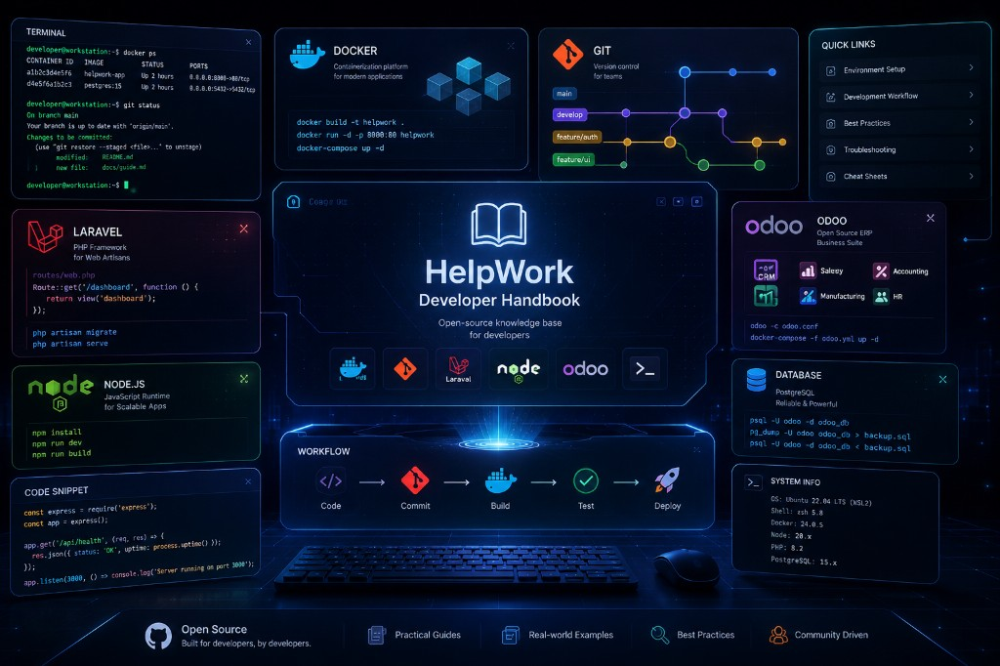

<p align="center">
  
</p>

# HelpWork Developer Handbook


A practical, community-driven handbook for daily development workflows, setup guides, and troubleshooting notes.

## Table of Contents

- [Overview](#overview)
- [Docker \& WSL](#docker--wsl)
- [Git](#git)
- [PHP \& Laravel](#php--laravel)
- [Node.js](#nodejs)
- [Odoo](#odoo)
- [Recent Updates](#recent-updates)
- [Contributing](#contributing)
- [Author](#author)

## Overview

This repository centralizes quick references and step-by-step guides for common developer tasks across multiple stacks.

## Docker & WSL

[Open detailed guide](Docker/README.md)

Key topics:

- WSL (Windows Subsystem for Linux) setup
- Docker installation on Windows/WSL
- Frequently used Docker commands (`ps`, `images`, `run`, `stop`, `rm`)
- Supporting tools setup (Make, Windows Terminal, Cursor)

## Git

[Open detailed guide](Git/README.md)

Key topics:

- Core Git commands (`clone`, `init`, `add`, `commit`, `push`, `pull`)
- Clone a specific branch (`git clone -b <branch>`)
- Git identity setup (username, email)
- Advanced workflows: squash, stash, interactive rebase
- Remote repository management
- SSH key setup for GitHub/GitLab

## PHP & Laravel

[Open detailed guide](PHP/README.md)

Key topics:

- Composer installation and usage
- `.env` file configuration
- Node.js integration in Laravel projects
- Asset build process with Laravel Mix

## Node.js

[Open detailed guide](Nodejs/README.md)

Key topics:

- Node.js download and installation references
- Fixing PowerShell "running scripts is disabled" issue on Windows

## Odoo

[Open detailed guide](Odoo/README.md)

Key topics:

- Odoo 18 installation on Ubuntu/Debian
- Dependency and PostgreSQL setup
- `odoo.conf` configuration
- Database and service management commands
- Performance tuning and backup/restore basics

## Contributing

Want to improve this handbook? Follow these steps:

1. Fork this repository.
2. Create a new feature branch:
   ```bash
   git checkout -b feature/your-guide-name
   ```
3. Add or update content in the relevant folder.
4. Commit your changes:
   ```bash
   git commit -m "Add [guide name]"
   ```
5. Push your branch and open a Pull Request.

Contribution guidelines:

- Keep guide content in Vietnamese (as the team standard)
- Use one folder per technology/topic with its own `README.md`
- Follow clean Markdown formatting
- Add runnable examples whenever possible

## Author

**UncleCat**

- GitHub: [@unclecatvn](https://github.com/unclecatvn)

If this handbook is useful, please consider giving it a star.
